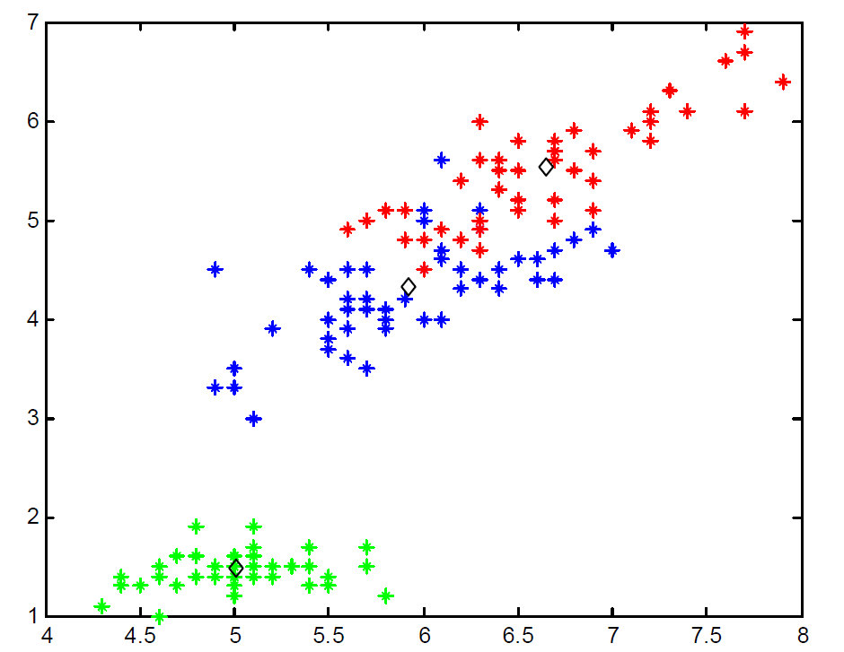

About me
======

Hi! I'm a senior undergraduate student at the University of Toronto, majoring in Computer Science and Mathematics.

I’m broadly interested in geometry processing, physics-based animation, computer vision and machine learning application in those 3 fields.

During the third year in undergraduate study I have made a publication related to k-means algorithm. In later years I have worked with Prof. [David Levin](http://142.93.146.228/researchdb/) on projects in field of physics-based animation and Prof. [Alec Jacobson](https://www.cs.toronto.edu/~jacobson/) on projects in field of geometry processing

 

Publications
======

&nbsp; __A New Fuzzy Belonging-based Multi-view K-means Clustering Algorithm__ 
&nbsp;  __Junda Zhao__, Weiling Cai, Yizhen Ge, Lijuan Zhang 
&nbsp;  *IEEE 10th IEMCON 2019* 
&nbsp;  [Paper](../files/A_New_Fuzzy_Belonging-based_Multi-view_K-means_Clustering_Algorithm.pdf)  

 

Selected Projects
======

<strong>An approach toward human musculoskeletal system simulation</strong>

 
Human musculoskeletal system is a complicated system and is affected 
by many factors such as muscle strength, bone stiffness, mass, etc. 
To simulate such system as a whole is very complicated, so is it possible 
if we start on something simple such as a basic unit of bones and muscle 
and build the more complex system based on this unit? This project aims 
to build very simple and basic unit of a Musculoskeletal system and 
simulate such unit. The model will be based on very simple objects 
such as mass points, rod, and springs to represent bones and muscle.
We also applied machine learning method for fast approximation of state 
of the system

[Project Page](https://github.com/jundaz/simple_spring_model/) 

  
   
  

 

Contact
======
junda.zhao (at) mail.utoronto.ca