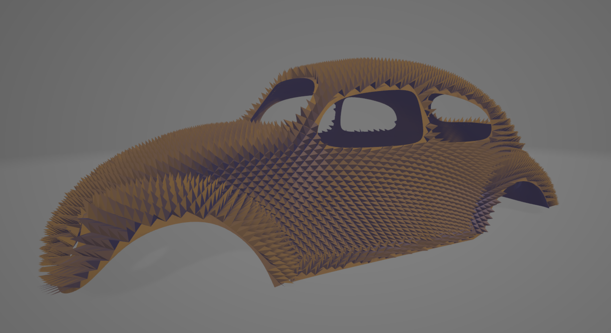
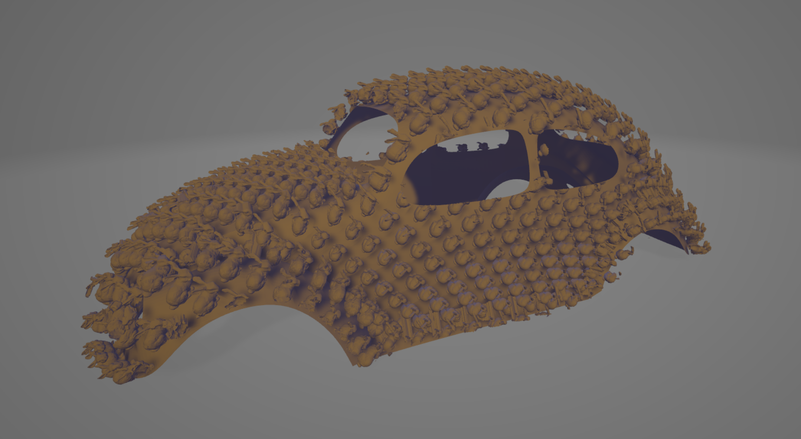
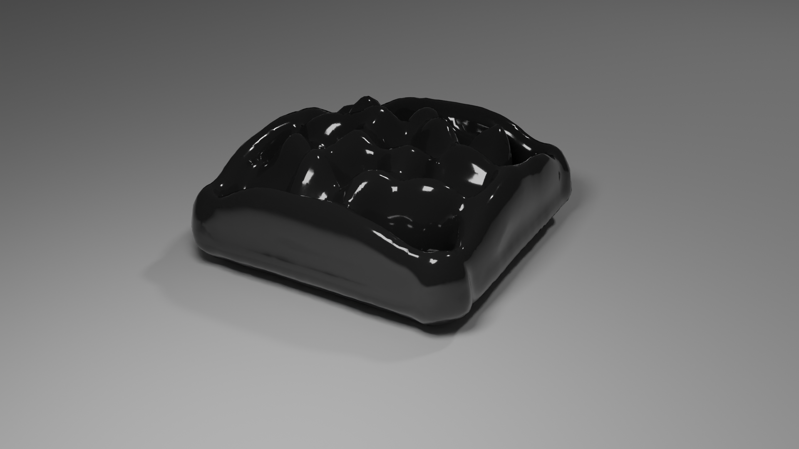
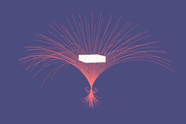
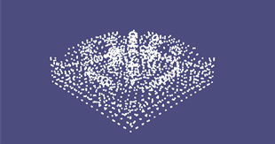

About me
======

Currently, I'm a Graduate student at the University of Toronto, Department of Mechanical & Industrial Engineering, pursueing Master of Applied Science degree under supervision of Prof. [Eldan Cohen](https://www.mie.utoronto.ca/faculty_staff/eldan-cohen/)

My main interest of research focuses on sequence model and natural language model.

During my Undergraduate years I have worked with Prof. [Alec Jacobson](https://www.cs.toronto.edu/~jacobson/) on projects in field of geometry processing and Prof. [David Levin](http://142.93.146.228/researchdb/) on projects in field of physics-based animation.

 

Publications
======

&nbsp; __A New Fuzzy Belonging-based Multi-view K-means Clustering Algorithm__ 
&nbsp;  __Junda Zhao__, Weiling Cai, Yizhen Ge, Lijuan Zhang 
&nbsp;  *IEEE 10th IEMCON 2019* 
&nbsp;  [Paper](../files/A_New_Fuzzy_Belonging-based_Multi-view_K-means_Clustering_Algorithm.pdf)  

 

Selected Projects
======

<strong>Feature-Grid Based Texture synthesis and transfer</strong>

Texture synthesis and transfer has been a popular topic
in recent years, this project aims to develop a novel method of texture 
synthesis and transfer based on a neural implicit representation of arbitrary 
object and provide a robust tool that would allow transfering such object as 
texture to arbitrary target surface. Since this method is based on a 2d feature-
grid, it allows some interesting computer vision based manipulation.
 
[Project Page(comming soon)] 

  
   

 

<strong>An Approach Toward Human Musculoskeletal System Simulation</strong>

 Human musculoskeletal system is a complicated system and is affected 
by many factors such as muscle strength, bone stiffness, mass, etc. 
To simulate such system as a whole is very complicated, so is it possible 
if we start on something simple such as a basic unit of bones and muscle 
and build the more complex system based on this unit? This project aims 
to build simple and basic unit of a Musculoskeletal system and simulate 
such unit. The model will be based on very simple objects such as mass 
points, rod, and springs to represent bones and muscle. We also applied 
machine learning method for fast approximation of state of the system.

[Project Page](https://github.com/jundaz/simple_spring_model/) 

  
   
  

 

<strong>Accurate Large Scale Ferrofluids Simulation</strong>

 Ferrofluid has a lot of interesting appearance when placed under a magnetic 
field. The most significant one is the formation of complex spikes. This 
shape is usually hard to create by artist in animation. Despite the use in 
art, ferrofluid can be used in a variety of engineering area due to its 
physical properties. This project provides an implementation of ferrorfluid
simulation based on paper “On the Accurate Large-scale Simulation of Ferro-
fluids” by Huang, L. etal.

[Project Page](https://github.com/jundaz/Accurate-Large-Scale-Ferrofluids/) 

  
   
  

 

<strong>Anime Art Style Picture Super Resolution Network</strong>

 Image Super resolution is a well-studied topic in computer vision, involving 
mainly the problem of re-obtaining lost information while doing scaling up. 
This project focuses on the super- resolution of a specific group of images 
with anime art style, including both denoising and scaling up. Due to the 
specialness of anime art style, instead of using traditional large-scale 
deep Convolutional Neural Network, I use a much smaller scale neural 
network with less layer and trainable parameter but at the same time 
achieve comparable result with higher efficiency. 

[Project Page](https://github.com/jundaz/Anime-art-style-picture-super-resolution-using-CNN/) 

  
   

 

<strong>Biharmonic Distance</strong>

 Measuring distances between pairs of points on a 3D surface is a fundamental
problem in computer graphics and geometric processing. This project provides 
a implementation of Biharmonic distance method by Y.lipman et.al, 

[Project Page](https://github.com/jundaz/CSC419Final) 
<!-- 

  
   

 -->

 

Contact
======
junda.zhao (at) mail.utoronto.ca